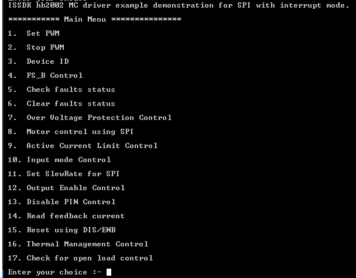

# NXP Application Code Hub

## FRDM-HB2002ESEVM Motor Controller driver with demo app running on FRDM-MCXN947 and FRDM-MCXA153

This demo application provides a command line interface which allows the user to easily explore the different functions of the driver to use the Motor controller features like controlling motor with PWM or SPI, checking faults like over-voltage, under-voltage, over-current etc with two input modes H-Bridge and Half-Bridge.

### FRDM-HB2002ESEVM Block Diagram

### Key Features of FRDM-HB2002ESEVM Motor Controller Driver

- Advanced diagnostic reporting via a serial peripheral interface (SPI): charge pump
undervoltage, overvoltage, and undervoltage on VPWR, short to ground and short
to VPWR for each output, open load, temperature warning and overtemperature
shutdown.
- Eight selectable slew rates via the SPI: 0.25 V/μs to more than 16 V/μs for EMI and
thermal performance optimization
- Four selectable current limits via the SPI: 5.4/7.0/8.8/10.7 A covering a wide range of
applications
- Extended high temperature operating range with current foldback while limiting the
current
- Can be operated without SPI with default slew rate of 2.0 V/μs and a 7.0 A current limit
threshold
- Drives inductive loads in a full H-bridge or Half-bridge configuration
- Wide operating range: 5.0 V to 28 V operation

#### Boards: FRDM-MCXA153, FRDM-MCXN947
#### Categories: Motor Control
#### Peripherals: ADC,GPIO, PWM, SPI
#### Toolchains: MCUXpresso IDE

## Table of Contents
1. [Software](#step1)
2. [Hardware](#step2)
3. [Setup](#step3)
4. [Results](#step4)
5. [FAQs](#step5) 
6. [Support](#step6)
7. [Release Notes](#step7)

## 1. Software
- [IoT Sensing SDK (ISSDK) v1.8](https://nxp.com/iot-sensing-sdk) offered as middleware in MCUXpresso SDK for supported platforms
- [MCUXpresso IDE v11.9.0](https://www.nxp.com/design/design-center/software/development-software/mcuxpresso-software-and-tools-/mcuxpresso-integrated-development-environment-ide:MCUXpresso-IDE)

## 2. Hardware
- FRDM-MCXN947 and FRDM-MCXA153 MCU board
- [FRDM-HB2002ESEVM Motor Controller Driver](https://www.nxp.com/part/FRDM-HB2002ESEVM) 
- Personal Computer
- Mini/micro C USB cable

## 3. Setup
### 3.1 Step 1: Download and Install required Software(s)
- Install MCUXpresso IDE 11.9.0
- Download and Install [MCUXpresso SDK v2.14.0 for FRDM-MCXN947](https://mcuxpresso.nxp.com/en/builder?hw=FRDM-MCXN947). Make sure to select ISSDK  middleware while building SDK.
- Download and Install [MCUXpresso SDK v2.14.2 for FRDM-MCXA153](https://mcuxpresso.nxp.com/en/builder?hw=FRDM-MCXA153). Make sure to select ISSDK  middleware while building SDK.
- Install Git v2.39.0 (for cloning and running west commands).
- Install Putty/Teraterm for UART.
 
### 3.2 Step 2: Clone the APP-CODE-HUB/dm-frdmhb2002esevm-motor-control-driver-demo-app
- Clone this repository to get the example projects:
- Change directory to cloned project folder: 
    cd *dm-frdmhb2002esevm-motor-control-driver-demo-app*
 
**Note:** If you are using Windows to clone the project, then please configure filename length limit using below command
**git config --system core.longpaths true**
 
### 3.3 Step 3: Build example projects
- Open MCUXpresso IDE and select a directory to create your workspace.
- Install MCXUpresso SDK 2.14.x for FRDM-MCX947, FRDM-MCXA153 (drag and drop SDK zip into "Installed SDK" view) into MCUXpresso IDE.
- Go to "Quickstart Panel" and click on "Import Project(s) from file system",
- Select "Project directory (unpacked)" and browse to the cloned project folder.
- Select example projects that you want to open and run.
- Right click on project and select build to start building the project.

## 4. Test Application Steps
- User need to check COM port after connecting USB cable between Host PC and Target Board via device manager.

- Open PUTTY/Teraterm application installed on your Windows PC with Baudrate 115200 and assigned COM port as mentioned in above step.

- After right click on project and select "Debug As", Demo application will run in interactive mode. When the demo runs successfully, you can see the logs printed on the terminal.

Note: By default SPI Controller operates in interrupt mode, to switch into EDMA mode Change:

RTE_SPI1_DMA_EN to 1 under board/RTE_Device.h for SPI

## 4.1 Logs Results

**Main Menu will look like this**

**Press #1 to Set PWM**

- Set PWM have two options:
   - Press #1 to  Setup PWM channel from scratch

    

   - Press #2 to Change duty cycle

    

**Press #2 to Stop PWM**

- By pressing option 2, user can stop PWM, after stopping PWM, motor stops.

**Press #3 to Get Device ID**

- By pressing option 3, user can get device ID.

    

**Press #4 for FS_B Control**

- FS_B Control have four options:
   - Press #1 to Enable FS_B (FS_B to become active when fault is active)

    

    Enable FS_B have thirteen options:

    

    User can choose any of these available option to FS_B pin follow the choosen faults
    status and option 13 is used to exit from  Enable FS_B menu.

   - Press #2 to Disable FS_B

    
    
    Disable FS_B have thirteen options:

    

    User can choose any of these available option to FS_B pin not follow the choosen faults
    status and option 13 is used to exit from Disable FS_B menu.

    - Press #3 to Read FS_B pin

    

    By pressing option 3, user can read FS_B pin status.

    

    - Press #4 to Exit from FS_B Control menu

    

     By pressing option 4, user can exit from FS_B Control menu.

**Press #5 to Check faults status**

- By pressing option 5, user can check available faults.

    

**Press #6 to Clear faults status**

- Clear faults status have thirteen options:

    

    User can choose any of these available option to clear choosen faults
    status and option 13 is used to exit from Clear faults status menu.

**Press #7 Over Voltage Protection Control**

- Over Voltage Protection Control have two options:

    - Press #1 to Enable Overvoltage protection

    

   - Press #2 to Disable Overvoltage protection

    

    After Disabling overvoltage protection, hb2002 will genarate OV (over voltage) warning only. 

**Press #8 Motor control using SPI**

- Motor control using SPI have seven options:

     

    - Press #1 to Enable motor control through SPI
         
         By pressing option 1, user can enable motor control through SPI.   

    - Press #2 to Disable Overvoltage protection

         By pressing option 2, user can disable motor control through SPI. 

    - Press #3 to Set virtual Input one (VIN1)

        By pressing option 3, user can set virtual Input one through SPI. 

    - Press #4 to Clear virtual Input one (VIN1)

        By pressing option 4, user can clear virtual Input one through SPI. 
    
    - Press #5 to virtual Input two (VIN2)

        By pressing option 5, user can set virtual Input two through SPI.

    - Press #6 to Clear virtual Input two (VIN2)

        By pressing option 6, user can clear virtual Input two through SPI. 

    - Press #7 to Exit

        By pressing option 7, user can exit from Motor control using SPI menu.

**Press #9 Active Current Limit Control**

- Active Current Limit Control using SPI have three options:

     

    - Press #1 to Enable Active Current Limit
         
         By pressing option 1, user can enable Active Current LimitI.   

    - Press #2 to Disable Active Current Limit

         By pressing option 2, user can disable Active Current Limit. 

    - Press #3 to Set Active Current Limit

        By pressing option 3, user can set Active Current Limit ( 0 to 3). 

        

**Press #10 Input mode Control**

- Input mode Control have Two options:

     

     - Press #1 for H-bridge control mode
         
         By pressing option 1, user can enable H-bridge control mode.   

    - Press #2 for Half-bridge control mode

         By pressing option 2, user can enable  Half-bridge control mode. 

**Press #11 Set SlewRate for SPI**
    

By pressing option 11, user can set SlewRate value ( 0 to 7). 

**Press #12 Output Enable Control**
   
- Output Enable Control have four options:

    

    - Press #1 Enable Output using SPI
         
        By pressing option 1, user can set ENBL pin high using SPI.   

    - Press #2 Disable Output using SPI

         By pressing option 2, user can set ENBL pin low using SPI.

    - Press #3 Enable Output using GPIO
         
         By pressing option 1, user can set ENBL pin high using GPIO.   

    - Press #4 Disable Output using GPIO [Sleep mode]

         By pressing option 2, user can set ENBL pin low using GPIO.

**Press #13 Disable Control**
   
- Disable Control have two options:

    

    - Press #1 Set Disable pin High [Standby mode]
         
        By pressing option 1, user can set DIS pin high.   

    - Press #2 Set Disable pin Low

         By pressing option 2, user can set DIS pin low.

**Press #14 Read feedback current**
    

By pressing option 14, user can read ADC count value for feesback current.

**Press #15 Reset using DIS/ENB**
   
- Reset using DIS/ENB have two options:

    

    - Press #1 Reset using ENBL pin
         
        By pressing option 1, user can Reset (short-circuit or overtemperature condition) by toggling of ENBL pin.   

    - Press #2 Reset using DIS pin

         By pressing option 2, user can Reset (short-circuit or overtemperature condition) by toggling of DIS pin.

**Press #16 Thermal Management Control**
   
- Thermal Management Control have two options:

    

    - Press #1 Enable Thermal Management
         
        By pressing option 1, user can Enable Thermal Management (ILIM derate to ILIM/2 on OT warning).   

    - Press #2 Disable Thermal Management

         By pressing option 2, user can Disable Thermal Management (ILIM derate to ILIM/2 from beginning).

**Press #17 Check for open load control**
   
- Check for open load control have two options:

    

    - Press #1 Enable Check for open load
         
        By pressing option 1, user can Enable Check for open load on transition from Standby to Normal mode.   

    - Press #2 Disable Check for open load

         By pressing option 2, user can Disable Check for open load on transition from Standby to Normal mode.

## 5. Know Limitations

 - we need to made some manual connection on HB2002 board using jumper wire.

    - For FRDMMCXN947

    

    - For FRDMMCXA153

    

## 6. FAQs
*"No FAQs have been identified for this project".*

## 7. Support

#### Project Metadata
<!----- Boards ----->
 

<!----- Categories ----->

<!----- Peripherals ----->

<!----- Toolchains ----->

Questions regarding the content/correctness of this example can be entered as Issues within this GitHub repository.

>**Note**: For more general technical questions regarding NXP Microcontrollers and the difference in expected funcionality, enter your questions on the [NXP Community Forum](https://community.nxp.com/)

## 8. Release Notes
| Version | Description / Update                           | Date                        |
|:-------:|------------------------------------------------|----------------------------:|
| 1.0     | Initial release of FRDM-HB2002ESEVM with FRDM-MCXN947 AND MXCA153 on Application Code Hub        | 30 Augth 2024 |

